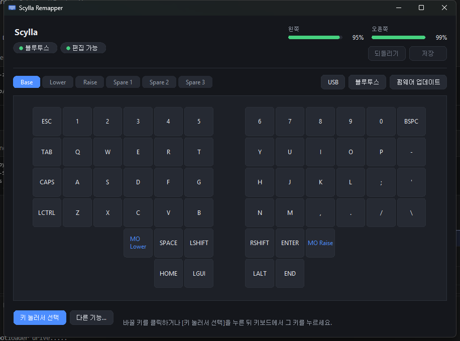

# Scylla — wireless ZMK config + a press-to-remap app

A dongle-less wireless [Scylla](https://bastardkb.com/scylla/) (4x6+5, 58 keys) on
Pro Micro nRF52840 controllers, and a desktop app that remaps it the way a mouse
utility would: **press the key you want to change, then press what goes there.**



Three parts:

| | |
| --- | --- |
| [`config/`](config), [`boards/`](boards) | ZMK config for the keyboard, with ZMK Studio enabled |
| [`src/`](src) | a custom ZMK behavior that types out the connection status |
| [`remapper/`](remapper) | the app — Python, talks the ZMK Studio RPC over USB **or Bluetooth** |

---

## Why the app exists

ZMK Studio already edits keymaps live. Two things pushed this further:

**You cannot press the key you want to change.** Studio's RPC has no key-event
notification, so the keyboard never tells a host "position 34 was pressed" — you
click it on screen instead. The app works around that by briefly painting all 58
positions with distinct probe keycodes, reading which one arrives, then
discarding. Studio stages edits until an explicit save, so probing can never
damage saved settings.

**Bluetooth works on Windows.** ZMK's docs list BLE editing as Linux-only, but
that is a limit of the Studio app, not the platform. `CONFIG_ZMK_STUDIO_TRANSPORT_BLE`
is `default y`, so the firmware already exposes the RPC over GATT — see
[`remapper/README.md`](remapper/README.md) for the two gotchas that make it work.

Battery for both halves comes free with the BLE connection: the split central
proxies its peripheral as a second Battery Service.

---

## Firmware

Every push builds in Actions and publishes the `.uf2` files as a
[release](../../releases). To flash by hand:

```powershell
.\flash.ps1 left     # plug the LEFT half in, run this, then double-tap reset
.\flash.ps1 right    # move the cable to the RIGHT half
.\flash.ps1 reset    # settings_reset — only if the halves refuse to pair
```

Only the half physically connected by USB shows a bootloader drive, so flash one
half at a time. The app can do this for you: **펌웨어 업데이트** downloads the
latest release and writes it once you enter the bootloader.

| file | flash to |
| --- | --- |
| `scylla_left_studio.uf2` | left half (central, Studio-enabled) |
| `scylla_right.uf2` | right half (peripheral) |
| `settings_reset.uf2` | either half, to wipe pairing/settings |

### The one gotcha

Once you save anything from Studio or the app, the keyboard runs from flash
settings and **ignores `config/scylla.keymap`**. Later edits to that file do
nothing until you run "Restore Stock Settings", which discards everything you
changed live. Pick one source of truth — the file is the seed and the fallback.

Firmware is still needed for combos, macros, hold-tap tuning, extra layers and
new behavior types. Placing an *existing* behavior on a key is always a software
job, no reflash.

---

## Status report key

`Lower` + the key right of the bottom-left corner types the current state
wherever the cursor is:

```
out=ble prof=2 conn=1 batt=96/100
```

| field | meaning |
| --- | --- |
| `out` | endpoint in use. `out=ble?usb` means USB is preferred but not connected |
| `prof` | active BLE profile index |
| `conn` | 1 if that profile has a live connection, 0 if only bonded |
| `batt` | this half / the other half |

Nothing else can report this. The Studio RPC has only `core`, `behaviors` and
`keymap` subsystems — no endpoint, profile or battery request — and those
subsystems are fixed in ZMK itself, so a module cannot add one. The keyboard has
to volunteer it, and the channel it always has is the keystrokes it already
sends. Battery is included because the BLE Battery Services are unreachable over
USB, making this the only way to see both halves on a cable.

Output is lowercase ASCII; a Hangul/Kana IME will transliterate the letters, so
switch to English first. The app reads raw scancodes and is unaffected.

Implemented in [`src/behavior_status_report.c`](src/behavior_status_report.c),
which makes this repo a Zephyr module. It types via
`raise_zmk_keycode_state_changed_from_encoded` — the entry point `&kp` uses — so
it rides ZMK's normal pipeline rather than poking HID, and does not depend on the
layout of `zmk_behavior_binding`, which gains a field when
`CONFIG_ZMK_BEHAVIOR_LOCAL_IDS_IN_BINDINGS` is set.

---

## Using ZMK Studio

The official app still works alongside this one. Over USB only one program can
hold the serial port, so close one before opening the other; the remapper
releases the port whenever its window is closed.

Unlock chord: hold **Lower** and press the **bottom-left corner key** (`LCTRL` on
the base layer). Without it Studio and the app are read-only. To skip the step,
set `CONFIG_ZMK_STUDIO_LOCKING=n` in `config/scylla.conf` and reflash the left
half. The keyboard re-locks after 10 minutes idle and on disconnect.

---

## Shield notes

Studio needs the keymap to come from a `zmk,physical-layout`, not a
`chosen zmk,matrix_transform`:

- `boards/shields/scylla/scylla.dtsi` — kscan matrix and `scylla_transform`, with
  no `chosen` transform
- `boards/shields/scylla/scylla-layouts.dtsi` — the 58-key physical layout Studio
  draws, generated from the board geometry so its order matches the transform

The row/column GPIO mapping matches the working 2023 config at
[gkstkdduq1/zmk-config](https://github.com/gkstkdduq1/zmk-config), which is where
the base keymap (QWERTY + lower + raise) also comes from.

Thanks to [amadeusolofsson/zmk-scylla](https://github.com/amadeusolofsson/zmk-scylla)
for a working Scylla shield to start from. That repo carries no license, so
nothing is copied from it here — the shield files were rewritten or regenerated,
and the pin mapping is the board's own wiring.

### Pro Micro nRF52840 clones (SuperMini etc.)

The build targets `nice_nano//zmk`, which defaults to nice!nano **v2**. Clones
are pin-compatible so keys work, but the battery voltage divider differs and the
reported percentage may be wrong. It can be redefined in a board overlay.

---

## License

MIT — see [LICENSE](LICENSE). ZMK itself is MIT.
